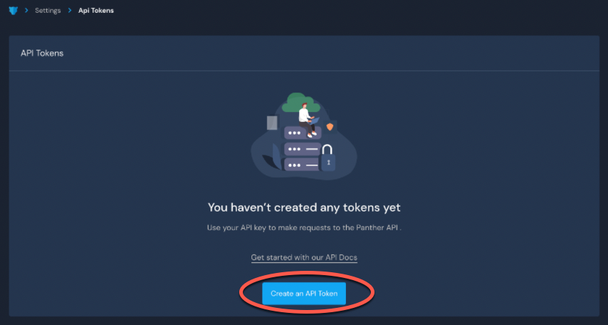
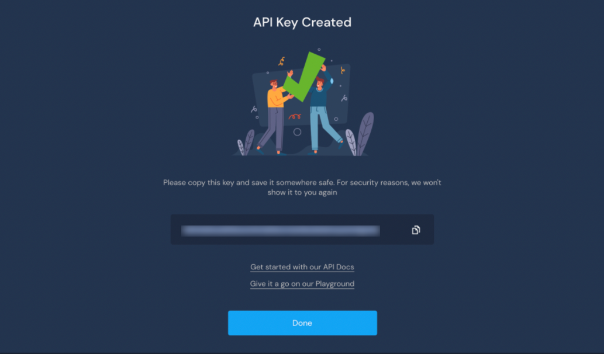
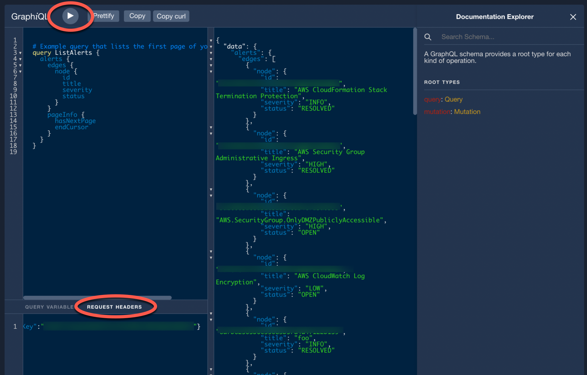

# Generating an API Token

In order to use the Panther API, you must generate an API Key. In the Panther UI, we refer to this as an API Token.&#x20;

To generate an API Token:

1. Log in to your Panther Console.
2. Navigate to **Settings > API Tokens.**
3. Click **Create an API Token**.\
   
4. Pick a friendly name for the API Token and configure the alert and permission settings.
5. Click **Create API Token**.&#x20;

You will see a success screen that displays the value of the API Token. Please note that the API Token is sensitive information and it will not be displayed again; **make sure you copy the API Token and store it in a secure location**.

### Testing the API Token


There may be a propagation delay of 30 to 60 seconds after adding an API Token.&#x20;


After generating an API Token, you can test to verify that it works as expected:

1. On the API Token creation success screen, click the link that says `Give it a go on our Playground.`
2. Locate the **REQUEST HEADERS** tab at the bottom-left corner of the Playground screen. Under this tab, change the default value of the `X-API-Key` header from `<ENTER_YOUR_KEY_HERE>` to the value of your API Token.
3. In the upper left corner, press the "play" icon to run the test.

You can discover the available queries, mutations, and fields by clicking **Documentation Explorer** on the right side panel of the Playground.&#x20;

For additional ways to discover the schema, see the [Discovering the Schema documentation](https://docs.runpanther.io/api-beta/discovering-the-schema).
