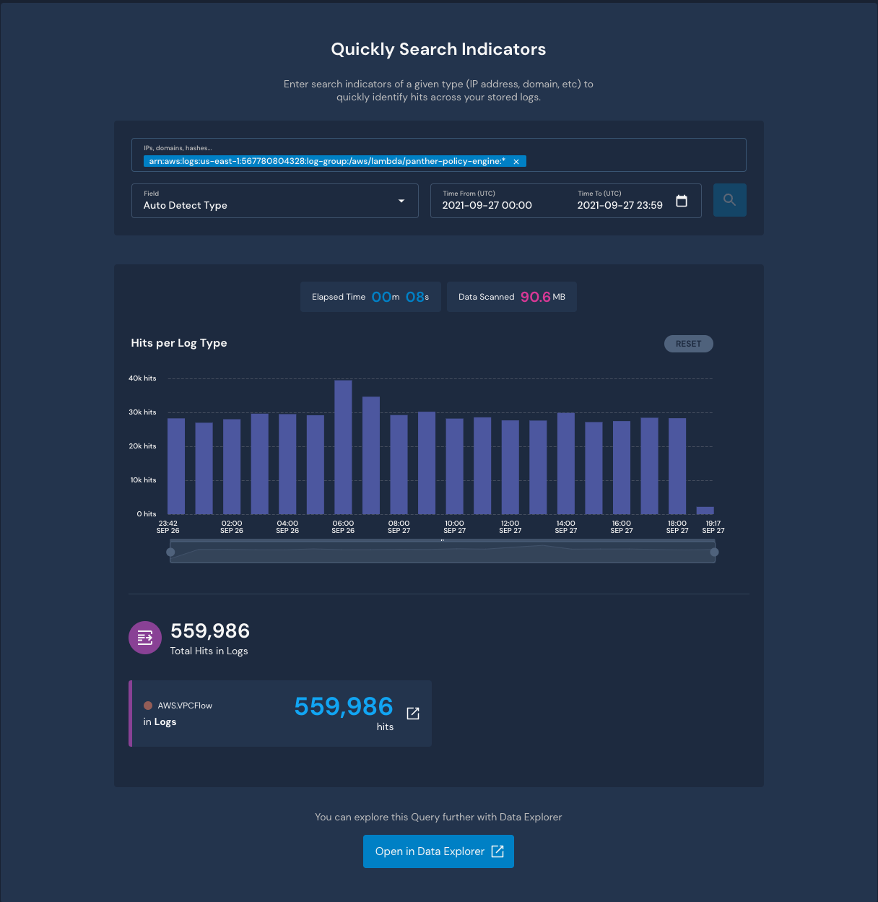

# Indicator Search

Use Indicator Search to run quick investigations on common indicators across various data sources. Indicator Search eliminates the need to run SQL searches to answer quick questions about suspicious activity and presents results in a simple visualization.

The Indicator Search is designed to be simple and easy to use:

* Start your investigation with one or more known indicators.
* Copy & paste the indicator\(s\) into the search field. The search will find ALL connected events associated with the indicators

  in the specified time range.

  * You can mix types of indicators \(e.g., IP addresses, domain names, ARNs, file hashes\).

* A timeline histogram shows the concentration of events over the specified time interval.
* Drill down into specific events by pivoting into the Data Explorer with prebuilt SQL queries.
* Find additional indicators in the Data Explorer and perform another search to gain additional context about the attack.
* Continue to pivot through your data to map the entire attacker footprint.

As with all of our enterprise features, access to the Indicator Search can be limited through our [Role-Based Access Control](../system-configuration/rbac.md) system.

#### Pivoting

Indicator Search can also be accessed via the "Events" tab of an alert details page. This makes it easy to quickly pivot off an interesting indicator When hovering over a "p\_any" field in the JSON view of an alert details page, you'll see a search icon appear next to the field. 

Click on the icon and select the date range you would like to search against. 

Run the search and see indicator search results!

