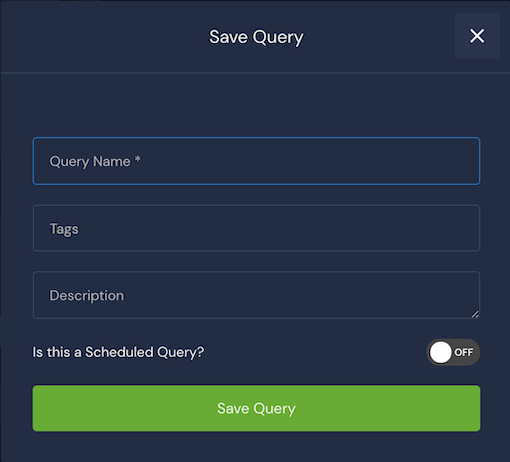
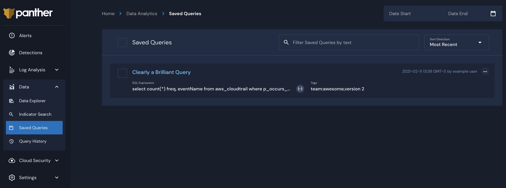
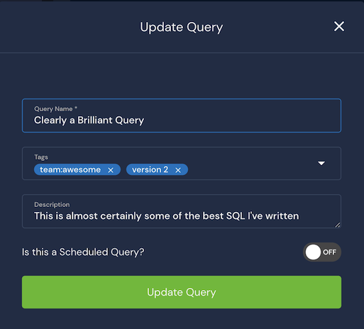
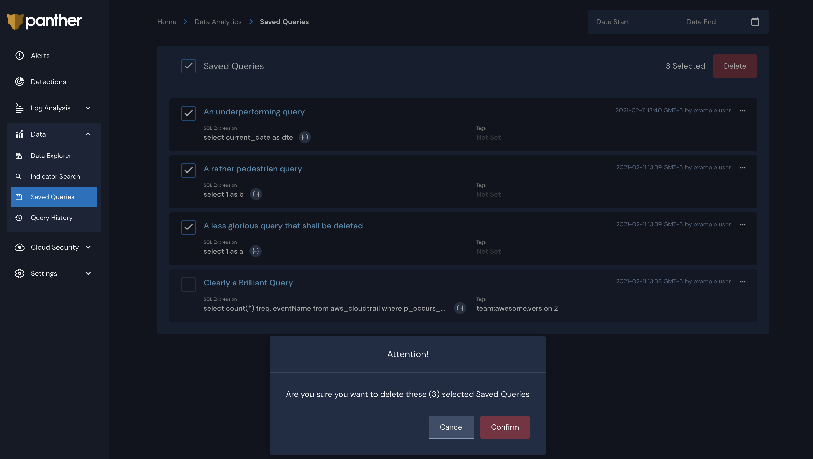

# Saved Queries

## Save a Query and View Saved Queries

In order to save a query, you can click on the `Save As` button located below the editor screen. This will allow you to give your saved query a name. Optionally, you may also add a description and tags that can help you group similar queries together. If you are trying to create a Scheduled Query, see the [Scheduled Queries documentation](scheduled-queries.md). Click `Save Query` to save your query. You should see a success message pop up in the bottom right of your window.

Once a query is saved, it will be available to all users with Data Explorer permissions. You can view a list of existing queries by navigating to `Data -> Saved Queries` on the left-hand side menu bar.  In the Saved Query screen you can search for queries either by using the time selector to look for queries modified in a time window, say the last 24 hours. You can also use the search box to search the queries by name, by their description, by part of their SQL code or by their tags.

Clicking on the name of the saved query should take you directly to data explorer, where you can run your query.

Clicking on the More Options Menu \(the ellipsis to the far right of the query name\) you can also choose to edit the query metadata \(i.e. change the tags, description or schedule queries\).

## Load a Saved Query

In the `Data -> Data Explorer` screen, you can load a saved query by clicking on the `Open` button, which will open a menu of saved queries with a search bar. You can use that bar search the queries by name, by their description, by part of their SQL code or by their tags.

Another way to open a Saved Query is to navigate to `Data -> Saved Queries` and simply click on the name of the query you wish to open. That should populate the query in Data Explorer.

## Update a Saved Query

If you've made changes in Data Explorer the SQL code for a Saved Query which you would like to save, you can simply click Update. This will also allow you to change the tags, name or description of the saved query. 

## Delete a Saved Query

Navigate to `Data -> Saved Queries`. By using the checkbox next to the query name to select multiple queries, you may also delete queries, individually or in bulk. Please note that scheduled queries must be unlinked from their respective rules in order to be deleted. This is to prevent users from accidentally erasing queries used by scheduled rules.

