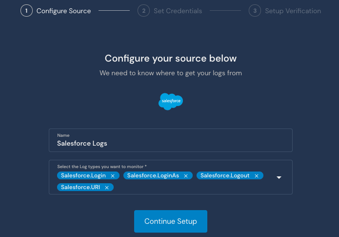

# Salesforce


This is feature will be made available in version 1.17


Panther has the ability to fetch [Salesforce Event Monitoring](https://trailhead.salesforce.com/content/learn/modules/event_monitoring/event_monitoring_intro) logs for the following event types:

* [Login](https://developer.salesforce.com/docs/atlas.en-us.api.meta/api/sforce_api_objects_eventlogfile_login.htm)
* [LoginAs](https://developer.salesforce.com/docs/atlas.en-us.api.meta/api/sforce_api_objects_eventlogfile_loginas.htm)
* [Logout](https://developer.salesforce.com/docs/atlas.en-us.api.meta/api/sforce_api_objects_eventlogfile_logout.htm)
* [URI](https://developer.salesforce.com/docs/atlas.en-us.api.meta/api/sforce_api_objects_eventlogfile_uri.htm)


Salesforce customers must [enable Event Monitoring](https://help.salesforce.com/articleView?id=000339868\&type=1\&mode=1) first. An additional license may be required for this Salesforce add-on.


## Create an API User

Panther requires a user account with API and Event Log File permissions in order to retrieve Event Monitoring logs.

We recommend creating a new, dedicated user with the minimum permissions required by Panther. Salesforce requires each user to have a [unique username](https://help.salesforce.com/articleView?id=sf.basics_intro_usernames_passwords.htm\&type=5), but the same email address can be included in multiple users. Thus, you can create a Panther-only account without having to manage an additional email address in your organization.


In order to create and add permissions to the new user, the ['Manage Users' permission](https://help.salesforce.com/articleView?id=000324398\&type=1\&mode=1) is required.


Follow the instructions in the [Salesforce documentation](https://help.salesforce.com/articleView?id=sf.adding_new_users.htm\&type=5) to add a new user. For the **User License** and **Profile** fields, make sure "Salesforce" and Read Only" are selected, respectively. (see below)

Complete the user registration process by setting a new password.

### Retrieve Security Token 

Salesforce API access requires, in addition to the username and password, a credential named _Security Token_.

In order to request a security token for new Salesforce user account, you can follow the instructions [here](https://help.salesforce.com/articleView?id=sf.user_security_token.htm\&type=5). The security token will be sent via email to the account email address.

### Create and assign a new Permission Set

In order to assign permissions to the new user we need to create a new [Permission Set](https://help.salesforce.com/articleView?id=perm_sets_overview.htm\&type=5). Follow the instructions in the [Salesforce documentation](https://help.salesforce.com/articleView?id=sf.perm_sets_create.htm\&type=5) to add a new permission set that will grant Panther access to the Event Monitoring data via the SOAP/REST API.

After creating the permission set, go to **System Permissions** by clicking on the link:

Click on the **Edit** button and select the following permissions:

**API Enabled** 

**Event Log Files** 

After the System Permissions have been updated, you can assign the Permission Set to the designated user by following the instructions [here](https://developer.salesforce.com/docs/atlas.en-us.securityImplGuide.meta/securityImplGuide/perm_sets_assigning.htm).

## Create a new Salesforce Source in Panther

1. Login to your Panther deployment
2. Go to **Integrations** > **Log Sources**
3. Click the "plus" icon at the top right of the page to add a new log source
4. Select **Salesforce** from the list of available sources
5. Click **Start Source Setup**
6. Enter a friendly name for the source, e.g. `Salesforce Logs`
7. Select which log types you would like to monitor
8. Next, fill in the credentials of the account that Panther will use to connect to the Salesforce API:
   * **Account Username**: e.g. `panther-logs@mycompany.com`
   * **Account Password**: the account password
   * **Security Token**: the Security Token (see [here](salesforce.md#retrieve-security-token) for instructions)
9. Click **Continue Setup**. At this step the credentials are also verified.

You are done! You can now start writing detections and exploring your Salesforce data.

