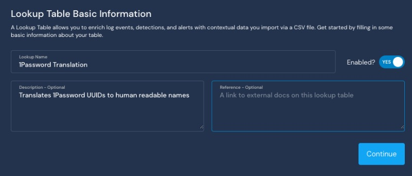
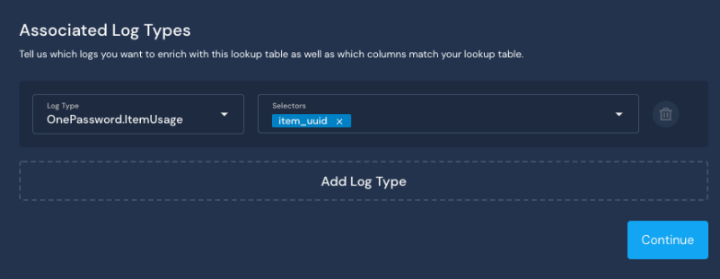
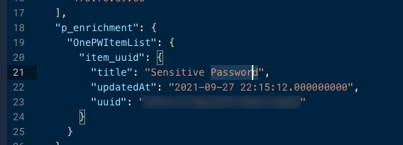

# Using Lookup Tables: 1Password UUIDs

By default, 1Password logs do not contain human readable values for objects such as vaults and login credentials. Instead, each object is referenced by a Universally Unique Identifier (UUID). You can use [Lookup Tables](https://docs.runpanther.io/data-analytics/lookup-tables) in Panther to translate the UUIDs to friendly names. We recommend using Command Line Interface (CLI), but it is also possible to use the API.


For more information on Lookup Tables, please see Panther's documentation: [Lookup Tables (BETA)](https://docs.runpanther.io/data-analytics/lookup-tables)


In the following example, we extracted a list of 1Password items and their associated UUIDs via CLI, then created a Lookup Table to translate the UUIDs into their human-readable friendly names.&#x20;

**Prerequisites**:

* An existing 1Password log source with data being ingested to your Panther account&#x20;
* The Command Line utility jq installed
* The [1Password command-line tool](https://1password.com/downloads/command-line/) is installed

**Obtaining a list of 1Password items with their associated UUIDs**

1. Log in to 1Password via CLI.
2. Use the following function to extract a list of 1Password items including their associated UUIDs and save it to a JSON file called _1password\_lookup.json_: `op list items | jq -c '.[] | {uuid:.uuid,title:.overview.title,updatedAt:.updatedAt}' >> 1password_lookup.json`

``

**Creating a Lookup Table in Panther**

1. Log in to your Panther account. In the left-hand navigation, click **Enrichment > Lookup Tables**.
2. In the upper right, click **+** to create a new Lookup Table.
3. On the Lookup Table Basic Information page, add a Lookup Name, and optionally a description and reference. \
   
   * In this example, the Lookup Name is “1Password Translation” and the Description is “Translates 1Password UUIDs to human readable names.”&#x20;
   * The Reference field is generally used to store a hyperlink to a related internal resource.
4. Click **Continue**.&#x20;
5. On the Associated Log Types page, select the Log Type **OnePassword.ItemUsage**. Under Selectors, add `item_uuid`. \
   &#x20;
6. Click **Continue**.&#x20;
7. On the Table Schema page, add the schema you created based on your 1Password JSON file. For the Primary Key Name, select `uuid`.&#x20;
   * If you have not created a schema yet, please follow the documentation here to create one before moving on to the next step: [Generating a Schema for a Custom Log Type from Sample Logs](https://docs.runpanther.io/data-onboarding/custom-log-types#generating-a-custom-log-type-from-sample-logs).
8. Click **Continue**.&#x20;
9. On the Import Data page, click **Select file** then select the OnePasswordItems JSON file.&#x20;
10. Click **Finish Setup** to go back to the list of Lookup Tables.

Now that you've created a Lookup Table, you can write detections based on the additional context from your Lookup Table. We will cover writing detections using these new values in the following sections.

**Obtaining data for a detection**&#x20;

1. Log in to your Panther account, and in the left-side navigation, click **Data Explorer**.&#x20;
2. Write a new query to extract the first 10 lines of your OnePassword items: `select * from your_company_logs.public.onepassword_itemusage limit 10`
3. In the "Results" table at the bottom of the page, click **View JSON** next to one of the records.&#x20;
4. Copy the JSON text to your clipboard.

In the example below, we are writing a detection based on the name given to a specific set of login credentials from a 1Password vault. In this case, the login name in 1Password is labeled “Sensitive Password.”

**Writing a Detection**

1. In the left-side navigation of your Panther account, click **Detections**.&#x20;
2. On the Detections page, click **+** in the upper right to create a new Detection.&#x20;
3. At the top of the page, click **Rule**.&#x20;
4. In the Log Type field, choose "OnePasswordItems."
5. Under “Functions & Tests”, click **Create Test**. Paste in the JSON text you copied from Data Explorer.&#x20;
6. Click **Enrich Test Data** and verify that the title is listed as a friendly name under the `p.enrichment` field:\
   
7.  In the text box labeled “Rule Function”, paste in the following:\
    `from panther_base_helpers import deep_get`

    `def rule(event):` \
    &#x20;   `if deep_get(event, "p_enrichment", "1Password Translation","item_uuid", "title") == "Sensitive Password":` \
    &#x20;   `return True`
8. [Run tests](https://docs.runpanther.io/writing-detections/testing) on your new detection. When you are finished testing, click **Save** in the upper right side of the page.

``
