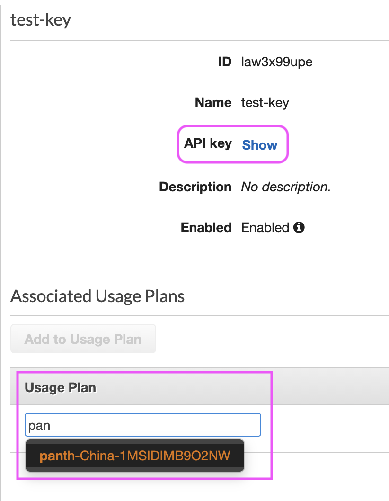
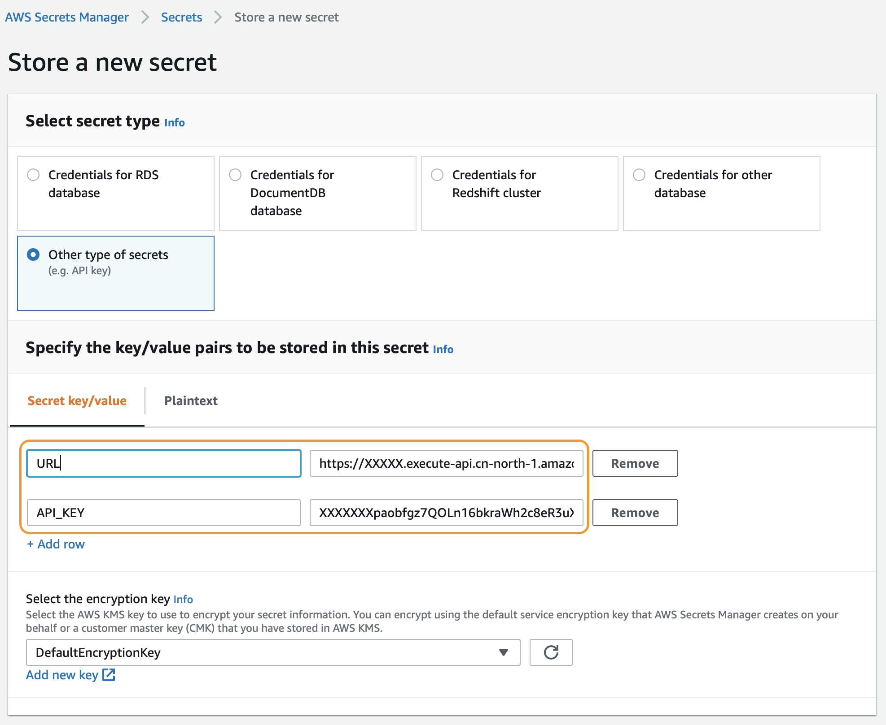
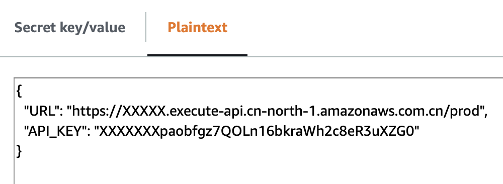

# AWS China

At this time, Amazon Cognito User Pools are not supported in AWS China. This means it is not possible today to deploy Panther end-to-end in China.

However, it _is_ possible to split the infrastructure - you can deploy just the Panther backend in China and keep Cognito \(user management\), AppSync \(GraphQL\), and the web app running in a standard region nearby. Your security team logs in to the web running outside of China and then their requests are routed over the Internet \(authenticated via API Gateway\) to the Panther instance in Beijing or Ningxia. This allows you to manage Panther _as if_ the web app were running in China - it will look and feel essentially the same \(if a touch slower\).

## AWS Accounts

You will need at least 2 AWS accounts:

* A standard AWS account, with access to deploy the Panther web stack to `ap-southeast-1`or `ap-southeast-2` This account also needs to be authorized for Panther asset downloads.
* An AWS China account, with an S3 bucket for storing release assets and access to deploy the Panther backend

You must provide your own AWS accounts: you will be responsible for copying release assets into China and you will manage your own Panther deployment.

## Backend \(China\)

First, you have to "publish" the latest Panther release to an S3 bucket in China.

1. Download the appropriate release copy script for your architecture:
   * [https://panther-community-us-east-1.s3.amazonaws.com/v1.20.0/tools/darwin-amd64.zip](https://panther-community-us-east-1.s3.amazonaws.com/v1.20.0/tools/darwin-amd64.zip)
   * [https://panther-community-us-east-1.s3.amazonaws.com/v1.20.0/tools/linux-amd64.zip](https://panther-community-us-east-1.s3.amazonaws.com/v1.20.0/tools/linux-amd64.zip)
   * [https://panther-community-us-east-1.s3.amazonaws.com/v1.20.0/tools/linux-arm.zip](https://panther-community-us-east-1.s3.amazonaws.com/v1.20.0/tools/linux-arm.zip)
   * [https://panther-community-us-east-1.s3.amazonaws.com/v1.20.0/tools/windows-amd64.zip](https://panther-community-us-east-1.s3.amazonaws.com/v1.20.0/tools/windows-amd64.zip)
   * [https://panther-community-us-east-1.s3.amazonaws.com/v1.20.0/tools/windows-arm.zip](https://panther-community-us-east-1.s3.amazonaws.com/v1.20.0/tools/windows-arm.zip)
2. Using _standard_ AWS credentials, download the latest Panther release assets to your device. For example:

   `AWS_REGION=us-west-1 ./releasecopy-darwin-amd64 -type download -bucket panther-enterprise-us-west-1 -release v1.20.0`

   You can download these from any [published Panther region](../quick-start.md#supported-aws-regions).

3. Using _AWS China_ credentials, upload the Panther release assets from your device to an S3 bucket in Beijing or Ningxia:

   `AWS_REGION=cn-north-1 ./releasecopy-darwin-amd64 -type upload -bucket your-china-bucket-here -release v1.20.0`

   Before uploading, this will transform the templates, removing resources not supported in China and changing our S3 asset references to your China bucket.

Once the release assets are finished uploading to S3, you can deploy the top-level `v1.X.Y/panther.yml` stack in AWS China, either as a new stack or as an update to an existing stack.

You'll need to repeat this process for each Panther release.

### API Gateway

Once Panther has finished deploying in China, you will have an API gateway named `panther-cn-bridge` and an associated API key. This API gateway is how the web app proxy \(running outside of China\) will communicate with the Panther backend in China.

You need to lookup the gateway URL and the API key in China, then copy those values to AWS Secrets Manager in your web proxy region \(outside China\).

To get the gateway URL, navigate to the API gateway console, select `panther-cn-bridge`, and then click "Stages" on the left sidebar. We want the "prod" stage - note the invocation URL


Create a new API key:


Then associate that API key with the "usage plan" for the API gateway and copy the secret key:



Before deploying the web app, you can use `curl` to test the URL and API key directly like so:

```bash
curl -H "x-api-key: {GATEWAY_API_KEY}" \
     --request POST \
     --data '{"listIntegrations": {}}' \
     {INVOKE_URL}/cn/panther-source-api
```

Replace `{GATEWAY_API_KEY}` with the api key from the gateway console, and replace `{INVOKE_URL}` with the invocation URL for the prod stage \(it should be an https URL ending in `/prod`\). If the response is a nonempty JSON list, you're all set!


Be very careful with your API key, since it grants full control over the Panther backend.

The key should be rotated periodically - we recommend rotating the key each time you upgrade your Panther deployment.


## Proxy Web App \(Outside China\)

Currently, the proxy web app must be deployed in `ap-southeast-1` \(Singapore\) or `ap-southeast-2` \(Sydney\). If you need a different region, just let us know.

### AWS Secrets Manager

In the region where you will be deploying the web app \(`ap-southeast-1`, in our example\), store the URL and API key as a secret in AWS secrets manager.

1. Go to the [Secrets Manager console](https://ap-southeast-1.console.aws.amazon.com/secretsmanager/home?region=ap-southeast-1#!/newSecret?step=selectSecret) to store a new secret
2. Select "Other type of secrets \(e.g. API key\)"
3. Add a `URL` key with the API gateway stage URL, e.g. `https://XXXXX.execute-api.cn-north-1.amazonaws.com.cn/prod` \(make sure it ends in /prod\)
4. Add an `API_KEY` key with the API key



The plaintext version of the secret should be valid JSON with those 2 keys:



1. You can use the default encryption key or choose your own. Click Next
2. Panther expects `panther/china` as the secret name by default, though you can also choose your own.
3. Add a description - the remaining options can be left on their defaults. Finish creating the secret.

To change the API key, simply generate a new key in the API gateway in China, then update the secret value in secrets manager in the proxy region \(Singapore\).

### Deploy Web App

Now, you can deploy the web app to Singapore. This process is essentially the same as a normal Panther deployment \(and will need to be repeated for each release\). Create a new CloudFormation stack from the appropriate CloudFormation template depending on your region:

* [https://panther-enterprise-ap-southeast-1.s3-ap-southeast-1.amazonaws.com/v1.20.0/proxy\_panther.yml](https://panther-enterprise-ap-southeast-1.s3-ap-southeast-1.amazonaws.com/v1.20.0/proxy_panther.yml)
* [https://panther-enterprise-ap-southeast-2.s3-ap-southeast-2.amazonaws.com/v1.20.0/proxy\_panther.yml](https://panther-enterprise-ap-southeast-2.s3-ap-southeast-2.amazonaws.com/v1.20.0/proxy_panther.yml)

You will need to set the following stack parameters:

* `FirstUserEmail` - email address for the initial admin invite
* `SecretID` - the name of the secret in AWS secrets manager
  * Defaults to `panther/china` - you only need to change this value if you chose a different name for the secret

    Once you login to the Panther web app, the version shown in the general settings will have a `-china-web-proxy` suffix


