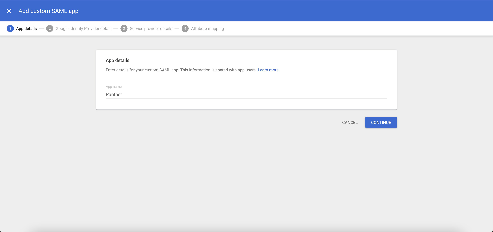
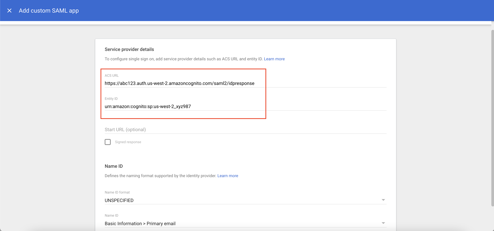
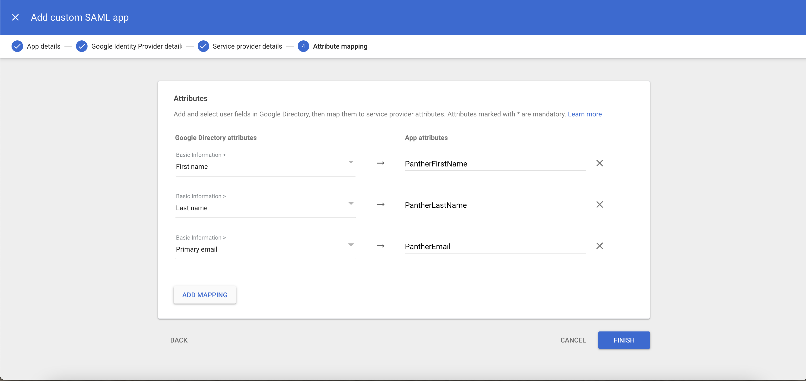
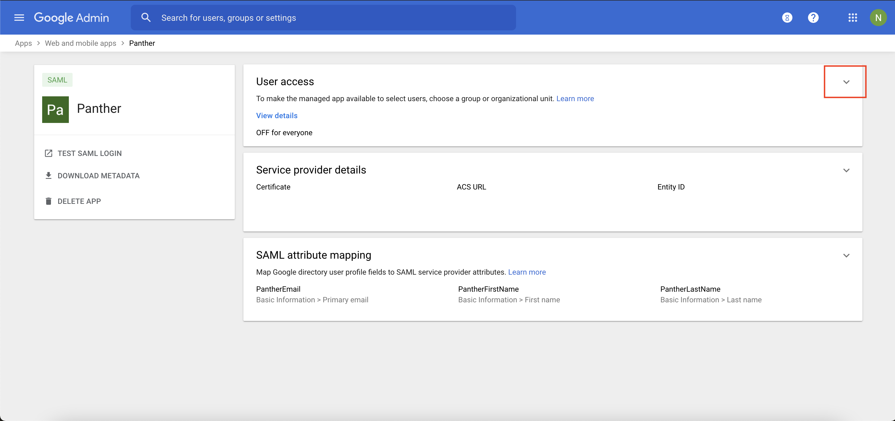
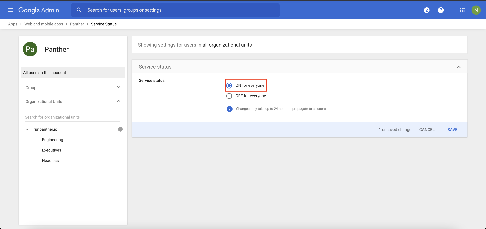

# GSuite

First, [deploy](../../quick-start.md) Panther and go to the General Settings page. Note the values for "Audience" and "ACS URL":

## Create GSuite App

Follow the [GSuite guide for SAML-based SSO](https://support.google.com/a/answer/6087519), which we trace step-by-step below:

Go to the [Apps Admin console](https://admin.google.com/ac/apps/unified) and select "Add App" -&gt; "Add custom SAML app"

Enter an application name:

Download the metadata file and keep this handy.

Leave all the settings on this page as their default values and click "continue."

Configure the ACS URL and Entity ID using the values shown in the Panther General Settings page:

* ACS URL: Use the "ACS Consumer URL" shown in the Panther General Settings
* Entity ID: Use the "Audience" shown in the Panther General Settings

Leave the rest of the fields as their defaults and click "continue." Configure the attribute mapping as follows:

* First Name -&gt; "PantherFirstName"
* Last Name -&gt; "PantherLastName"
* Primary email -&gt; "PantherEmail"

Click Finish. Now we need to enable the app: click the down array next to User Access to expand this tab:

Toggle the app to "On for everyone" \(or more selectively assign to OUs if you prefer\) and click "save."


You are now done configuring GSuite, but it may take up to 24 hours for your changes to propagate. Usually, however, it finishes within a few minutes.


## Publish the Metadata File

Panther does not yet support direct uploads of SAML metadata files \(we're working on it!\)

In the meantime, you will need to publish that metadata file \(which shouldn't contain sensitive information, but double-check to be sure\) to a public S3 bucket or any other public location so you can generate a URL for it.

The URL must be HTTPS, and it must point to the public XML metadata document.

## Configure Panther

From the Panther settings page, enable SAML with a default [Panther role](../rbac.md) of your choice and paste the URL which points to the metadata file that you published.

Don't forget to switch to "Enabled", click "Save", and then you're done! Now, clicking the "Login with SSO" button will redirect you to GSuite:


Amazon Cognito \(which powers Panther's user management\) does not yet support IdP-initiated login, meaning you cannot login to Panther from GSuite. The login must be initiated from Panther, the service provider.

For this reason, the "Test SAML Login" button in the GSuite admin console may not work, but as long as you can login from Panther you have configured it correctly.


