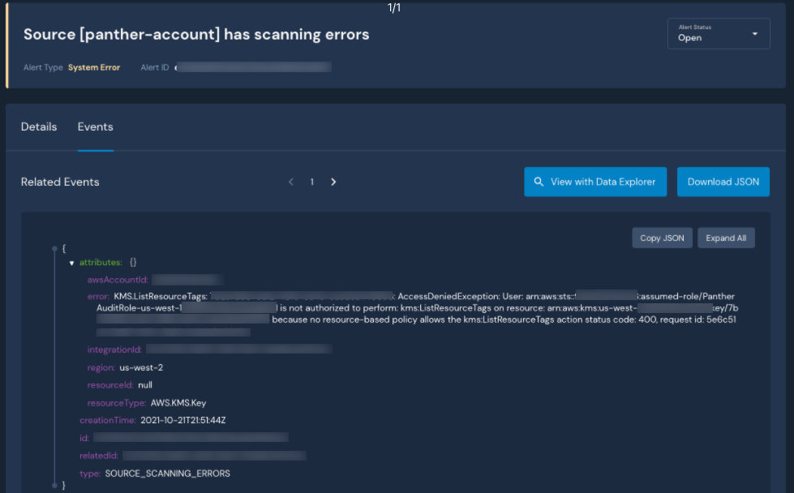

# Cloud Security Scanning Failure

Cloud security scanning failure alerts are generated when Panther fails to scan a cloud resource because of an "access denied" error.&#x20;

This occurs when permissions are not configured properly to allow scanning to occur. This is most commonly caused by one of three scenarios:

* Our scanning role (`PantherAuditRole`) is not configured with sufficient permissions.&#x20;
  * This is an extremely rare case as the permissions of this role rarely change. This can be resolved by updating the `PantherAuditRole` to the latest version.
* An AWS organizations Service Control Policy (SCP) is preventing our scanning role from carrying out scans.&#x20;
  * Commonly this occurs with SCP's with restrictions for certain regions or services. This can be resolved by either modifying the SCP to add an exception for our scanning role, or by modifying the Cloud Security integration to exclude certain regions or resource types.
* An AWS resource base policy is preventing our scanning role from carrying out scans.&#x20;
  * In AWS, permissions are bidirectional. The `PantherAuditRole` may be granted permission to access a resource, but the resource itself may not grant permission to be accessed by our role. This can be resolved by either modifying the resource based policy to add an exception for our scanning role, or by modifying the Cloud Security integration to exclude certain resources or resource types.


This type of alert is classified as a "System Error." **Be sure to configure a destination to receive the "System Error" alert type to keep track of these types of errors**. Additionally, you can view this alert in the "System Errors" sub-tab of the "Alerts & Errors" section of the Panther UI.


The alert will indicate which resource scanning failed on, and the AWS error that caused the scanning to fail:

You can use this information to pinpoint the exact permissions issue. In the example above, we can see `no resource-based policy allows the kms:ListResourcetags action`. This indicates to us that the issue is related to a resource-based policy.
