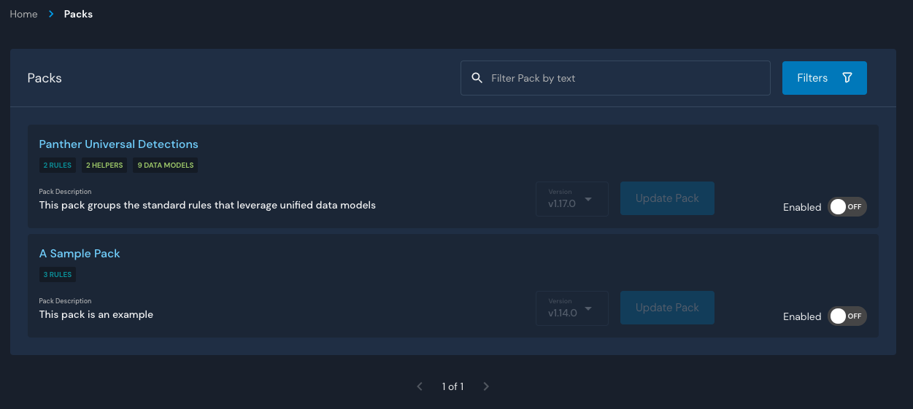
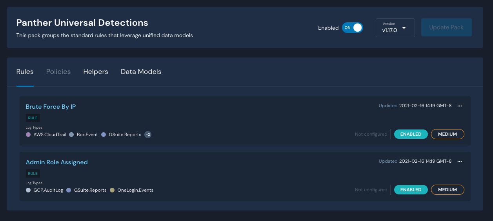
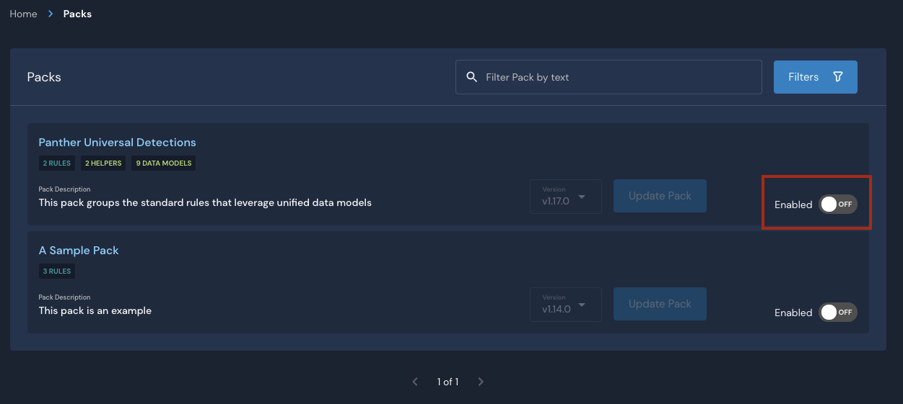
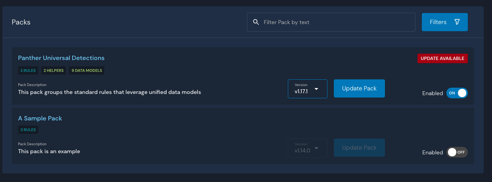
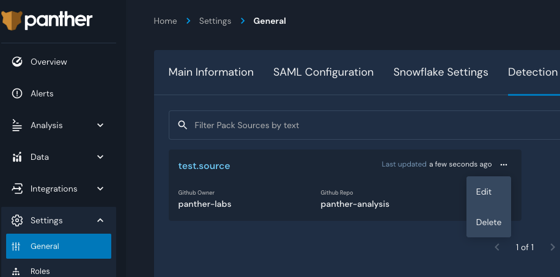

# Detection Packs

Packs are used to logically group detections as well as enable detection updates via the Panther UI. Panther-provided packs are defined in the open source repository, `panther-labs/panther-analysis`.

A single pack can group any number of detections, queries, global helpers, and data models. For example, one of the provided detections packs, `Panther Universal Detections`, groups all the rules that rely on data models and all of their dependencies.

Updates to detections in these packs are tracked automatically by the Panther backend. When a new update for a detection pack is available in the `panther-analysis` repository, the list packs page will be display an `update available` flag next to the relevant items.

Detections that are part of an enabled detection pack will be labeled as `MANAGED` , and detections that are not part of an enabled detection pack will be labeled as `UNMANAGED`.

## Panther Built-In Detection Packs

Panther provides several detection packs out of the box. There are packs that group all the panther provided detections related to a particular log source, but there are also detections packs that are grouped on a particular focus, such as generic rules that leverage unified data models or a core set of detections for AWS.&#x20;

| Display Name         | Description                                                           |
| -------------------- | --------------------------------------------------------------------- |
| Universal Detections | This pack groups the standard rules that leverage unified data models |

## Viewing Detection Packs

Panther provided detection packs can be view in the pack overview page. Navigate to `Analysis` > `Packs` to view a list of the provided packs.



Pack details, including a description, the enabled status, the currently enabled version, and which detections are in the pack, can be viewed in the pack details page. Simply click on a pack in the list to view its details page.



## Managing Detections with Packs

When a pack is enabled, panther will install and enable the detections in that pack.  When this happens, panther will update the python body, tests, and a majority of the metadata with the panther-provided version. It will not overwrite a few commonly customized fields, these include: DedupPeriodMinutes, OutputIDs, Severity, and Threshold.&#x20;

Packs will also create detection backups in order to prevent loss of customizations to those detections.  When enabling or updating a pack, panther will automatically create a disabled backup of that detection, if it determines there have been any changes.  These backups have the naming convention: `Backup.<original.id>.N` , where N is the number of backups already existing for that detection.  For example, `Backup.Standard.BruteForceByIp.2` is a backup for the detection `Standard.BruteForceByIp`.&#x20;

If you would like to maintain an enabled customization of a panther provided detection, best practice is to:

1. Disable the detection in the pack
2. Manually create a copy of the detection (with a different, unique ID)
3. Make any modifications to the copy

This will ensure there will be no conflict with the panther provided detection in the pack. &#x20;

## Enable and Disable Detection Pack

Packs can be disabled or enabled using the Panther UI. If you enable a pack, all the detections in the pack will be enabled. If you would like to disable a single or multiple detections within it, you can do this on a one-by-one basis without having to disable the entire pack. When you update a pack that has disabled detections, the detections will be updated but they will stay disabled.

There are two ways to enable or disable a pack. The first option is to navigate to `Analysis` > `Packs`. From the list of packs on this page, you can toggle the `enabled` slider to enable or disable individual packs.



You can also click on a specific pack to view the details of it. From the pack details page, you can also toggle the `enabled` slider to enable or disable the pack.


## Update or Rollback Detection Pack

New updates to detection packs will periodically be released to the `panther-analysis` repository. These updates will automatically be detected by panther, and the pack overview page will show an `Update Available` flag next to relevant packs.

You can update pack detections in your environment by navigating to `Analysis` > `Packs`. From this pack overview page, you can update the detections by selecting the version from the dropdown menu and hitting the `Update Pack` button.



On the other hand, if you would like to revert a pack version, you can select the appropriate version from the dropdown and hit the `Revert Pack` button.


## Pack Sources


This feature is available in Panther version 1.17


Pack Sources provide a way to configure custom Github sources for detection packs. Once a Pack Source is configured, Panther will check for new releases once a day. Custom packs can be managed using the same functionality as Panther-provided packs.

Pack source fields are described in the following table.

| Field Name    | Required | Description                                                      | Expected Value |
| ------------- | -------- | ---------------------------------------------------------------- | -------------- |
| `Owner`       | Yes      | The owner/organization of the target repository                  | String         |
| `Repository`  | Yes      | The name of the repository                                       | String         |
| `kmsKey`      | No       | The ARN for a sign/verify kms key to validate release signatures | String         |
| `AccessToken` | No       | Personal Access Token used to access a private repository        | String         |

### Accessing Private Repositories

In order for Panther to have access to poll a private repository, you must configure the Pack Source with a personal access token. See the [Github documentation](https://docs.github.com/en/github/authenticating-to-github/creating-a-personal-access-token) for further details on creating a token.

A personal access token will grant access to all the repositories where the account owner has access. Therefore, we recommend creating a ["machine user"](https://docs.github.com/en/developers/overview/managing-deploy-keys#machine-users) that you can add as an outside collaborator to the repository containing the detection packs. This way, the access token can be scoped for a particular use and repository.

### Release Signatures

The panther provided packs are signed using an asymmetric AWS KMS key. Prior to importing any detections from the panther pack source, it will validate the signature using the release asset, `panther-analysis.sig`. This ensures that any detections being imported have not been tampered or modified. If you would like to use similar functionality, [create a sign/verify KMS key](https://docs.aws.amazon.com/kms/latest/developerguide/create-keys.html). Then, modify the policy to allow panther to run `kms:Verify` using that key.

Sample entry to add to the key policy, where the account id should be replaced with the account id where panther is running:

```javascript
{
    "Sid": "Enable KMS Verify",
    "Effect": "Allow",
    "Principal": {
        "AWS": "arn:aws:iam::{accountid}:root"
    },
    "Action": "kms:Verify",
    "Resource": "*"
}
```

### Managing Pack Sources

Navigate to `Settings` > `General` and click on the `Detection Pack Sources` tab.

To Add a pack source, click on the `+` at the top right. Enter in the approrpriate field names for each input field and click `Save`.


To modify the `kmsKey` or `AccessToken` fields for a pack source, first go to the pack source details by selecting the pack source of interest from the list of pack sources. From this page, edit the fields of interest, and click `Save`.


To Delete a pack source, click on the `...` next to the pack source you would like to delete and select "delete."




Deleting a pack source will delete the packs originating from it, along with all the detections in it.


### Creating a Github Release - Panther Analysis Tool

The `panther_analysis_tool` can streamline the process of creating an appropriate Github release, with or without an associated signature file.

To generate the release assets, use the `release` command.

```bash
% panther_analysis_tool release --help
usage: panther_analysis_tool release [-h] [--aws-profile AWS_PROFILE]
                                     [--filter KEY=VALUE [KEY=VALUE ...]]
                                     [--kms-key KMS_KEY]
                                     [--minimum-tests MINIMUM_TESTS]
                                     [--out OUT] [--path PATH] [--skip-tests]

optional arguments:
  -h, --help            show this help message and exit
  --aws-profile AWS_PROFILE
                        The AWS profile to use when updating the AWS Panther
                        deployment.
  --filter KEY=VALUE [KEY=VALUE ...]
  --kms-key KMS_KEY     The key id to use to sign the release asset.
  --minimum-tests MINIMUM_TESTS
                        The minimum number of tests in order for a detection
                        to be considered passing. If a number greater than 1
                        is specified, at least one True and one False test is
                        required.
  --out OUT             The path to store output files.
  --path PATH           The relative path to Panther policies and rules.
  --skip-tests
```

To automatically create a draft release in your Github repository, first set the `GITHUB_TOKEN` environment variable to a personal access token with appropriate permissions to access the target repository. Then, use the `publish` command.

```bash
% panther_analysis_tool publish --help
usage: panther_analysis_tool publish [-h] [--body BODY]
                                     [--github-branch GITHUB_BRANCH]
                                     [--github-owner GITHUB_OWNER]
                                     [--github-repository GITHUB_REPOSITORY]
                                     --github-tag GITHUB_TAG
                                     [--aws-profile AWS_PROFILE]
                                     [--filter KEY=VALUE [KEY=VALUE ...]]
                                     [--kms-key KMS_KEY]
                                     [--minimum-tests MINIMUM_TESTS]
                                     [--out OUT] [--skip-tests]

optional arguments:
  -h, --help            show this help message and exit
  --body BODY           The text body for the release
  --github-branch GITHUB_BRANCH
                        The branch to base the release on
  --github-owner GITHUB_OWNER
                        The github owner of the repsitory
  --github-repository GITHUB_REPOSITORY
                        The github repsitory name
  --github-tag GITHUB_TAG
                        The tag name for this release
  --aws-profile AWS_PROFILE
                        The AWS profile to use when updating the AWS Panther
                        deployment.
  --filter KEY=VALUE [KEY=VALUE ...]
  --kms-key KMS_KEY     The key id to use to sign the release asset.
  --minimum-tests MINIMUM_TESTS
                        The minimum number of tests in order for a detection
                        to be considered passing. If a number greater than 1
                        is specified, at least one True and one False test is
                        required.
  --out OUT             The path to store output files.
  --skip-tests
```


The `kms-key` argument is an optional argument that you can use to generate a signature file. If you want to use this argument, be sure to run panther\_analysis\_tool using the appropriate aws credentials to call `kms:Sign` on the specified key.

